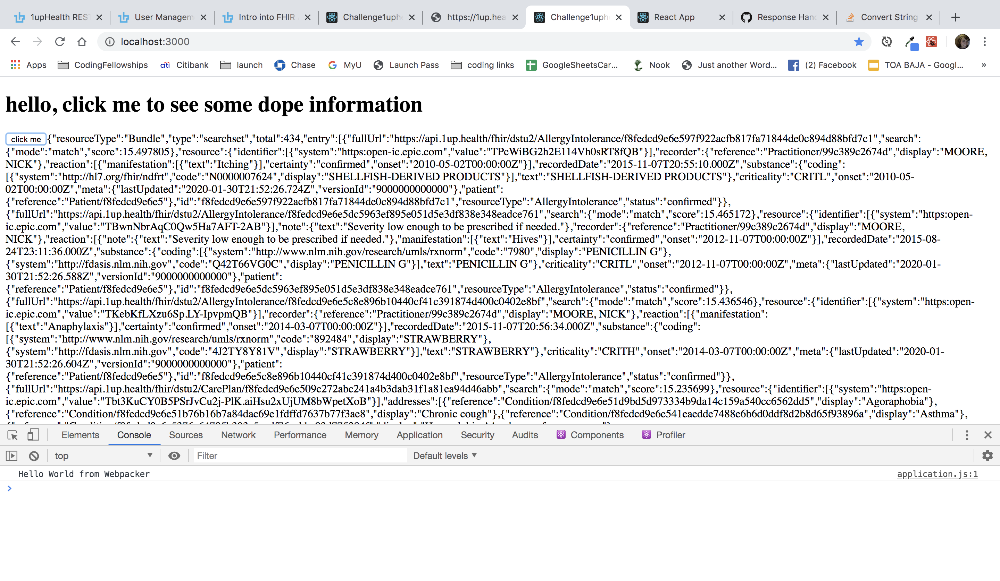

# README

Finished product displays patient info on a react frontend from 1upHealth's $everything query. 

To run the app, clone it and bundle install/yarn install. run ./bin/webpack-dev-server in one tab and rails s in another.

To render the data, you need to follow all steps to receive a new authorization token and insert it into the variable called "authorization token goes here' in controllers/api/v1/patient_info_controller in the app.

I used the http.rb gem to make api calls, and used pry for debugging. I used postman to make my http calls. I used ruby on rails as my backend. React was my frontend to display the patient information, I didin't style the data but if I were to work on this further I would map through it and put the relevent peices of it into components so it would look better.

